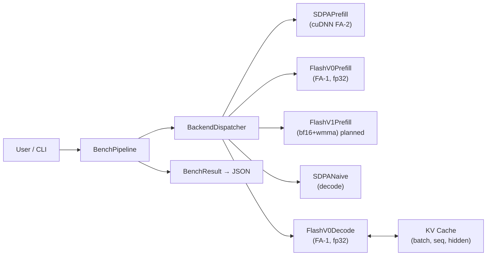

# LLM Inference Engine

A research-oriented LLM inference runtime focused on the attention path:
prefill, decode, and KV cache management — measured against PyTorch SDPA
(cuDNN FlashAttention-2) on real model shapes (Llama-3.2-1B, Llama-3-8B).

## Architecture



→ Full diagram and component descriptions: [docs/ARCHITECTURE.md](docs/ARCHITECTURE.md)

## Status

| Milestone | Description | Status |
|-----------|-------------|--------|
| **I0** | Benchmark harness (prefill/decode, JSON results, plots) | Done |
| **I1** | `v1`: bf16 + Tensor Core prefill path | Planned |
| **I2** | `v2`: GQA-native KV cache for decode | Planned |
| **I3** | lightweight runtime integration for demos / MLIS | Planned |

## Kernel versions

| Backend | Description |
|---------|-------------|
| `sdpa` / `sdpa_naive` | PyTorch baseline (cuDNN FlashAttention-2 internally) |
| `flashattn_v0` | Custom kernel - fp32, MHA, tiled FlashAttention-1 style |
| `flashattn_v1` *(planned)* | + bf16 + Tensor Cores (wmma) |
| `flashattn_v2` *(planned)* | + GQA-native KV cache |
| `runtime` *(planned)* | lightweight inference integration over the optimized backends |

## Project Structure

```
src/flashinfer_engine/
  backends/             # attention backend implementations
  config.py             # model + benchmark config loaders
  metrics.py            # latency / percentile utilities
  results.py            # BenchResult schema + JSON I/O

benchmarks/             # benchmark drivers
  benchmark_prefill.py
  benchmark_decode.py
  plot_results.py
  results/              # *.json artifacts
configs/
  models/               # llama3_2_1b.yaml, llama3_8b.yaml
docs/                   # architecture notes + figures
tests/                  # correctness + regression tests
```

## Quick Start

```bash
# Install
cd flashinfer_engine
uv pip install -e .   # or: pip install -e .

# Run baseline benchmarks (SDPA only — works on any GPU)
python benchmarks/benchmark_prefill.py --model configs/models/llama3_2_1b.yaml
python benchmarks/benchmark_decode.py  --model configs/models/llama3_2_1b.yaml

# Compare against custom v0 kernel
python benchmarks/benchmark_prefill.py \
    --model configs/models/llama3_2_1b.yaml \
    --backends sdpa flashattn_v0
python benchmarks/benchmark_decode.py \
    --model configs/models/llama3_2_1b.yaml \
    --backends sdpa_naive flashattn_v0

# Generate plots
python benchmarks/plot_results.py
```

## Latest Snapshot

See `docs/PERFORMANCE.md` for the current numbers and `docs/figures/`
for latency / TBT / speedup plots.

## Roadmap

- Mainline execution plan: `docs/PROJECT_ROADMAP.md`
- Canonical implementation plan: `docs/EXECUTION_PLAN.md`
- Documentation index: `docs/README.md`
