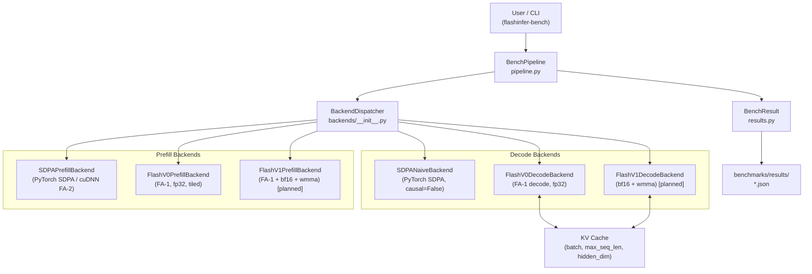
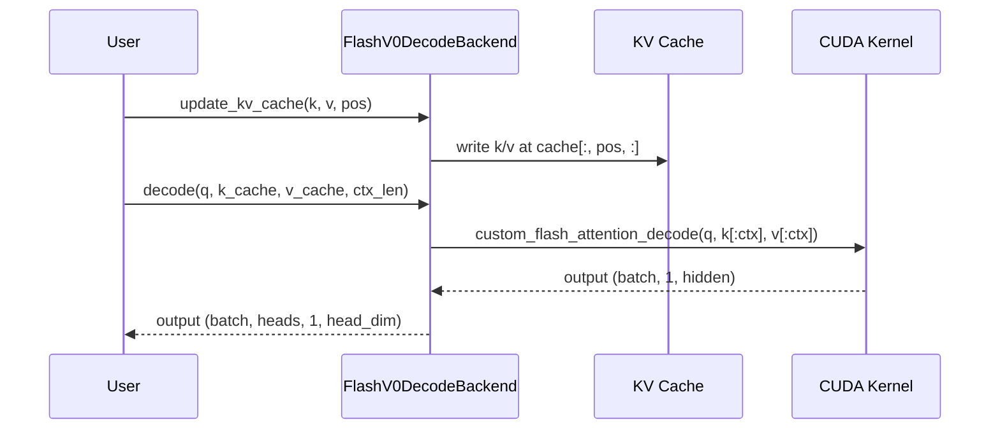

# Architecture

## System Overview



## Component Descriptions

### BenchPipeline (`pipeline.py`)
Orchestrates the benchmark loop: allocates tensors, calls the backend, measures
latency via CUDA events, and writes `BenchResult` to JSON.

### BackendDispatcher (`backends/__init__.py`)
Registry of all available backends. At import time, each backend attempts to
load its compiled `.so`; unavailable backends are silently excluded from
`available_prefill_backends()` / `available_decode_backends()`.

### Prefill Backends
| Backend | Kernel | dtype | Notes |
|---------|--------|-------|-------|
| `sdpa` | `F.scaled_dot_product_attention` | any | cuDNN / cutlass dispatch |
| `flashattn_v0` | `flashattention_kernel<Br,Bc,D>` | fp32 | FA-1 tiled, MHA only |
| `flashattn_v1` | `flashattention_v1_wmma` | bf16 | planned: Tensor Core |

### Decode Backends
| Backend | Kernel | dtype | Notes |
|---------|--------|-------|-------|
| `sdpa_naive` | `F.scaled_dot_product_attention` | any | causal=False, single-token |
| `flashattn_v0` | `flash_attention_decode_kernel<D>` | fp32 | FA-1 decode, static KV cache |
| `flashattn_v1` | `flash_attention_v1_decode_wmma` | bf16 | planned |

### KV Cache (`FlashV0DecodeBackend.update_kv_cache`)
Static flat layout: `(batch, max_seq_len, num_heads × head_dim)`.
`update_kv_cache(pos)` writes a single token's K/V at row `pos`.

Planned: paged KV cache (v3) with fixed-size blocks for variable-length sequences.

## Data Flow — Single Decode Step



## Directory Layout

```
flashinfer_engine/
├── src/flashinfer_engine/
│   ├── backends/          # Backend registry + wrappers
│   │   ├── __init__.py    # Registry, available_*_backends()
│   │   ├── sdpa.py        # PyTorch SDPA backends
│   │   ├── flash_v0_prefill.py
│   │   └── flash_v0_decode.py
│   ├── config.py          # ModelConfig (yaml → dataclass)
│   ├── metrics.py         # measure_latency, percentile_stats
│   ├── pipeline.py        # BenchPipeline
│   └── results.py         # BenchResult, save_result, load_results
├── csrc/
│   ├── flash_v0_prefill/  # CUDA source + setup.py
│   ├── flash_v0_decode/   # CUDA source + setup.py
│   └── compile.py         # python -m csrc.compile
├── benchmarks/
│   ├── benchmark_prefill.py
│   ├── benchmark_decode.py
│   ├── plot_results.py
│   ├── plot_correctness.py
│   └── compare_commits.py
├── configs/models/        # llama3_2_1b.yaml, mistral_7b.yaml, ...
├── docs/
│   ├── ARCHITECTURE.md    # this file
│   ├── PERFORMANCE.md
│   ├── EXECUTION_PLAN.md
│   └── archive/          # historical notes kept out of the main path
└── tests/
    ├── test_smoke.py      # CPU-only, always runs in CI
    ├── test_correctness.py # GPU: prefill vs SDPA
    └── test_kv_cache.py   # GPU: decode + KV cache semantics
```
